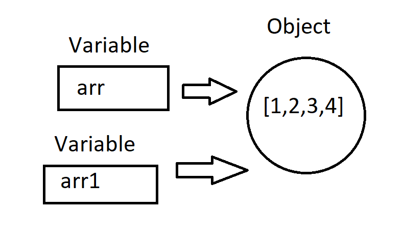

# Class 5: JavaDocs, 2D arrays, Intro into Objects

## JavaDocs

What is a **JavaDoc?** JavaDoc stands for Java Documentation,  for generating API documentation in HTML format from Java source code. It is a way to let people know what your methods do in a **readable format**. It's generally used for other people or yourself when you need to figure out what **something does**. 

JavaDocs are placed before methods or classes in a comment-like syntax. It contains things like **parameters, return type, exceptions, description, input, and more**.

Here's an example for a method called **factorial**, which returns the factorial of an integer.

```java
class Main {
	/** 
	 * This method returns the factorial of an integer, a mathematical operator.
	 * The factorial of a non-negative integer n returns the product of every positive 		 
	 * integer less than or equal to n. 0! = 1.
	 * </p>
	 * @param n - integer
	 * @return n! - the factorial of the integer n
	*/
    public static int factorial(int n) {
        // implementation
    }
}
```

As you can see, the way to start a JavaDoc is using `/** */`. You put them above the class/method you are writing it for.

You can see the JavaDoc in HTML format if you go to Window -> Show View -> JavaDoc, or Alt + Shift + Q.

There are special attributes that can be assigned to make things easier to see. They are added by putting an @ sign before the special keyword.

The most common ones are:

- @param: for addressing all parameters. Each parameter gets a @param classifier
- @return: tells the user what is returned by the method
- @throws or @exception: declares the specific errors thrown by the method
- @author: your name so people know who created the method

### When should I use a JavaDoc?

Create a JavaDoc for each class and method that you create. It's good practice. It is tedious, but it will help in the future if you ever look back on your work.

### Rule of Thumbs

For **Class JavaDocs**,  include the following:

- @author
- Your Name, the date, and the Project name
- What the Class is intended to do: a brief description of what is inside the class, and what the purpose is

For **Method JavaDocs,** include the following:

- The description of the method; what is is supposed to do
- @param: for each parameter, and its meaning within the domain of the method
- @return: what the method returns, and the data type
- @throws: what are the exceptions to the method? What is not allowed? Why would it throw this error?
  - for custom errors, generally

### Documentation

https://www.oracle.com/technical-resources/articles/java/javadoc-tool.html

Take a look if you're confused.

## 2D arrays

What are 2D arrays? Essentially, they're arrays inside arrays. Instead of a 1D list, it's more like a grid. 


Looks relatively similar to normal arrays, but now we just have multiple of them. 

### Syntax

This is how you make one:

```java
// rectangle with no initialization
// 5 rows x 3 columns
int[][] arr = new int[5][3];

// initialized array: 3 rows x 4 columns
int[][] arr = new int[][] {{1, 2, 3, 4}, {5, 6, 7, 8}, {9, 10, 11, 12}};
```

Essentially the same.

### Non-Rectangular Arrays

You can make a 2D array that has uneven column lengths. In other words, the arrays within arrays can have different lengths.

```java
int[][] arr = new int[][] {{1, 4}, {5, 6, 8}, {9, 10, 11, 12}};
```

Try to avoid them, and put in a filler element for "blank" indices. 

### How to access an element

Just use two brackets instead:

```java
int[][] arr = new int[][] {{1, 2, 3, 4}, {5, 6, 7, 8}, {9, 10, 11, 12}};

int thirdRowSecondElement = arr[2][1];

System.out.print(thirdRowSecondElement);
// 10
```

The first number in the bracket is the row (or the nth array within the array), and the second number is the column (the kth number of the nth array).

If (x,y) is a normal Cartesian plot, 2D arrays are more like (y, x). You'll figure it out.

### Use Cases

Emulating grid-like objects

- Chess
- Checkerboard 
- An image (pixel by pixel)
- Cartesian Grids

Those are just to name a few. You will likely encounter many problems that could use 2D arrays, and you'll be able to tell when you need them. 

### Iteration Through 2D Arrays

Well, we want to traverse them like a normal array.

In a 1D array, it would look like this:

```java
for(int i = 0; i < arr.length; i++) {
	System.out.print(arr[i] + " ");
}
```

2D arrays work relatively similarly. Since we have a x * y grid, we need to use two for loops instead. We will iterate through the array containing arrays, and then iterate through the array inside each index. 

#### For Each Implementation

As for normal 1D arrays, you can use for each for 2D arrays as well. It's a bit different, and also requires two for loops.

**Use if you only care about the values, and not changing them. **

```java
int[][] arr = new int[3][5];

for(int[] subArr: arr) {
	for(int element: subArr) {
        System.out.print(element + " ");
    }
    System.out.println();
}
```

**Show with picture**.

It would look something like this. 

```java
for(int i = 0; i < arr.length; i++) {
	for(int j = 0; j < arr[i].length; j++) {
        System.out.print(arr[i][j] + " ");
    }
    System.out.print("\n");
}
```

The `arr[i]` represents the "i-th" array, or the array contained in index `i`, since we are dealing with arrays inside an array. That's just the way Java implements 2D arrays. By using the length of the `ith` array, this method works with non-rectangular arrays as well. 

It will traverse like this:

```
i = 0
j = 0

i = 0
j = 1

i = 0
j = 2

...

i = 1 
j = 0

i = 1
j = 1

i = 1
j = 2

...

...
```

You can also traverse the array column by column instead of row by row only if you have a rectangular array. You can try this, but generally, you probably want to set up the array to iterate row by row. 

### Notables

You cannot "delete" an element. You can change elements, but they cannot be deleted

You cannot change the row or column length without creating a new array. 

### You can't compare arrays using ==

Use `Arrays.equals(arr1, arr2)`. It's a default method built in. 

```
String[] arr1 = {"hello", "bye", "hello again"};
String[] arr2 = {"hello", "bye", "hello again"};

System.out.print(arr1 == arr2);
// false
System.out.print(Arrays.equals(arr1, arr2));
// true
```

Reason? Because they **not the same object in memory**. This is a brief look into **pointers**. Just be mindful for now.

### Exercises

#### 1: Write a Java program to test if an array contains a specific value. 

#### 2: Write a method to calculate the average value of array elements

#### 3: Write a Java program to find the maximum and minimum value of an array.

## Method Overloading

One quick bit about methods before we move on:

You can methods with the same name, as long as:

- they have different type parameters or amount of parameters
- they have a different return type

For example:

```java
public static int max(int[] arr) {
	int max = arr[0];
	for(int i = 1; i < arr.length; i++) {
		if(arr[i] > max) {
			max = arr[i];
		}
	}
	return max;
}
public static double max(double[] arr) {
	double max = arr[0];
	for(int i = 1; i < arr.length; i++) {
		if(arr[i] > max) {
			max = arr[i];
		}
	}
	return max;
}
```

Two methods do the same thing, but require different inputs. Something you should keep in mind. 

## Objects

Let's talk about the way objects differ from normal primitives, other than the way they are created.

### Pointers

This is a simplified way of how objects truly work, but it gets the point across.

This is how objects are stored. Instead of being stored as a value, they are stored as a **location in memory**. The variable name **points** to the **location in memory**. Java does this for you. It is essentially an **alias**

Diagram:


What does this mean? Well, it's certainly not obvious yet.

Let's try doing something like this:

```java
int[] arr = {1, 2, 3, 4};

int[] arr1 = arr;
```

What will happen?

Do you expect it to make another object? Well, it doesn't. Instead, it looks like:



They **point to the same location in memory**. Essentially, they are **the exactly the same object**. 

Remember when I told you that variable names **for objects** are aliases? Well, they are. They reference the memory. 

Analogy:

- Your name is Michael, and people call you Mike. You can be called by **two names**, but you are the **same person**.

That's what Java does for objects.

### Consequences

Well, so what?

This means, if I do **something to one variable**, the effect will be seen by the **other**.

I'll show you.

```java
int[] arr = {1, 2, 3, 4};

int[] arr1 = arr;

arr[1] = 16;

System.out.print(arr1[1]);
// 16
```

Wait...what the heck?

It makes sense.

Analogy:

- If I slap Mike, I am also slapping Michael. They are the same person.

Ok. What about primitives?

```java
int i = 1;
int i1 = i;

i = 3;
System.out.print(i1);
// 1
```

So, what's the difference?

For primitives, the **value is passed**. There is no **object in memory**. It will pass the value instead of the same location in memory. 

You will need to think about this soon, even though it might not affect you yet.

Example of a way this gets confusing:

```java
public static void main(String[] args) {
	int[] arr1 = {1, 2, 3, 4};
    int[] arr2 = {5, 6, 7, 8};
    
    int[] arr3 = {9, 10, 11, 12};
    
    arr3[0] = 1;
    arr2 = arr3;
    arr1 = arr2;
    
}
```

What is each variable equal to?

We'll go through it together. 

#### Making a copy

One way to make a copy of an array (specifically). You can use the `.clone()` method. This will create a **new object**. 

```java
int[] arr = {1, 2, 3, 4};
int[] arr1 = arr.clone();

arr[1] = 100;
System.out.print(arr1[1]);
// 2
```

### Strings

As you might've noticed, I didn't use Strings as my example for this. This is because Strings are relatively unique. They are **immutable**. You can't even change a string. You can only create a new String object if you modify it using a method. Essentially, it returns a new String every time you modify it.

It's special because of the way it works and its common use cases. That's all.

### Creating an Object from Scratch

Will be up soon. 

## Homework

Will be added soon.


