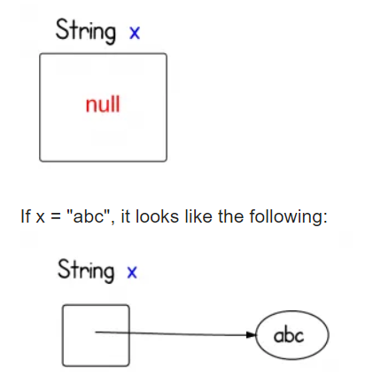

# Lesson 6: Objects

## The Null

You can set an **object** to **null**, which means it has **no value in any sense**. It represents a missing value. 

```java
String s = null;
```

Here's a diagram:



Instead of pointing to a value, it is given the **null identifier**. You can't do anything with it until you assign the variable to a real object.

### What is `null` in memory?

First of all, null is not a valid object instance, so there is no memory allocated for it. It is simply a value that indicates that the object reference is not currently referring to an object.

According to the JVM Specs: 

<blockquote>First of all, null is not a valid object instance, so there is no memory allocated for it. It is simply a value that indicates that the object reference is not currently referring to an object.</blockquote>

### Exceptions

The most common error trying to perform actions on a **null object** will return a `java.lang.NullPointerException`. For example, you can't call attributes or perform actions on something that has no value. We might encounter `null` in the future, but it's just something you need to know for now.

## Creating Objects

**Object** − **Objects** have states and behaviors. Example: A dog has states - color, name, breed as well as behaviors – wagging the tail, barking, eating. An **object** is an instance of a class. Class − A class can be defined as a template/blueprint that describes the behavior/state that the **object** of its type support.

We've dealt with some already so far:

```java
String s = "hello";

int[] arr = new int[5];

double[][] dArr = new double[5][6];

Integer i = 5;

Boolean b = False;
```

However, we haven't really covered the typical object you might create, or use.

### Identifiers

#### **Capitalized letters:** 

Objects will have a variable type with an uppercase first letter

```java
String s = "f";

Double d = 5.0;
```

**Exceptions**

Arrays. Arrays are a bit unique. They can hold primitive (non-Object) values, but they themselves are **objects**. 

```java
int[] arr = {1, 2, 3, 4, 5};
```

#### The "new" argument

Most objects you create (outside of the common ones) will follow this syntax:

```java
Person p = new Person("Eric");
```

You see the `new`? That means we are **creating a new object**, **allocating a portion of memory to that object**. 

You have seen it already:

```java
int[] arr = new int[5];
```

 Albeit, it's not exactly the same

**Exceptions**

Almost everything we've covered to far is an exception. This is because they are the most common objects that a programmer must create. Therefore, they are granted special syntax, so their creation is easier.

```java
// let's you create a variable like a primitive
String s = "stuff";

// has multiple ways to create one, all a bit different and "unstandard" 
int[] a1 = new int[5];
int[] a2 = new int[] {1, 2, 3, 4, 5};
int[] a3 = {1, 2, 3, 4, 5};

// Wrapper classes behave like strings and normal primitives
Integer i = 5;
Double d = 5.0;
Character c = '\n';
```

However, you can create Strings and wrapper classes using the "normal way", but there's no reason to. Most of them have been **deprecated** since Java9.

```java
String s = new String("stuff");

Integer i = new Integer(5);
```

So...just use the normal syntax to create these objects.

## Making your Own

All the default objects are already used by the JRE by default. How are they made? Well they are made using a **blueprint** from a **class**.

What does this mean? Each class can be used to make an object. 

As you have seen, most object names are **capitalized**, and so are the names of **classes**. It's not a coincidence; that's what makes Java an **object-oriented language**.

For String, the class associated with it is `java.lang.String`. Any classes within `java.lang` are used by default without any imports. **We'll take a look**.

### Constructor

Every class has a **constructor**. If we do not explicitly write a constructor for a class, the Java compiler builds a default constructor for that class.

Each time a new object is created, at least **one constructor** will be invoked. The main rule of constructors is that they should have the **same name as the class**. A class can have **more than one constructor.**

They **identify the parameters that are important to the object**.

#### Variable Types

There are **three types**

- **Local variables** − Variables defined inside methods, constructors or blocks are called local variables. The variable will be declared and initialized within the method and the variable will be destroyed when the method has completed.
- **Instance variables** − Instance variables are variables within a class but outside any method. These variables are initialized when the class is instantiated. Instance variables can be accessed from inside any method, constructor or blocks of that particular class.
- **Class variables** − Class variables are variables declared within a class, outside any method, with the static keyword.

Instance variables **define the attributes of an object** (for the most part). They are created within the `public class Object`, instead of a method. They are not created in the main. 

You usually **assign values to the instance variables within the different constructors.** They will be **unique for each "instance" of the object you create**. 

We will be making a `Person Object`, so if I have two people, they each have different names, ages, etc.

#### Example

```java
public class Person {
    public String firstName;
    public String lastName;
    public int age;
    public int height;
    
    public Person(String firstName, String lastName, int age, int height) {
        this.firstName = firstName;
        this.lastName = lastName;
        this.age = age;
        this.height = height;
    }
}
```

We have obviously created a `Person` object. You can't really create a Person variable without creating an object.

We identified a few aspects of a human:

- name
- age
- height

You can see the **instance variables** do not have any values assigned. This is what you want for attributes that are **different for each instance of that object**, such as a name or an age.

We assigned them within the constructor.

### Creating an object based on the Constructor

You make objects within the main or methods within a class (given the proper imports and scope).

```java
Person p = new Person("Dave", "Lee", 38, 70);
```

Follows the guidelines we set above.

Things to keep in mind:

- The parameters you pass in **must be in the same order as within the constructor**
  - Our order is: `firstName`, `lastName`, `age`, `height`
- You need the right **number of arguments**
- You need to pass the right variable **type**
- Use accurate names for your instance variables

### `this` keyword

What is **this**?

**Keyword** `this` in **Java** is a reference variable that refers to the **current object.** It can be used to refer current class instance variable. It can be used to invoke or initiate current class constructor. It can be passed as an argument in the method call.

So if you create an object in the main: 

```java
Person p = new Person("Dave", "Lee", 38, 70);
```

Within the **class itself**, you can invoke it by calling `this`.

So what are we doing when we do something like: `this.firstName = firstName`?

Well, you can see that the constructor takes in **parameters**, one parameter having the **same name as the instance variable**. How do we distinguish between the two?

By using `this`. It allows us to say: `this.firstName`, which refers to the instance variable, is equal to the **local variable**, `firstName`.

You can use different parameter names, but there is no reason to, since it will only make your code harder to understand. So usually, use the same parameter names as the **instance variable names**.

### Multiple Constructors

It follows a similar ideology to **method overloading**.

If the constructor has a different number of parameters, types, etc. It usually means that you want to simplify things that are repetitive. Not for our example, necessarily, but it could be for other objects.

```java
public class Person {
    
    public String firstName;
    public String lastName;
    public int age;
    public int height;
    
    public Person() {
        this.firstName = "John";
        this.lastName = "Doe";
        this.age = 50;
        this.height = 75;
    }
    
	public Person(String firstName, String lastName, int age, int height) {
        this.firstName = firstName;
        this.lastName = lastName;
        this.age = age;
        this.height = height;
    }
}
```

Maybe we want a default person, that's the most common or something. Then, we can do something like this. 

```java
// creates a John Doe
Person p = new Person();
```

Another implementation can be using `this`

``` java
public Person() {
	this("John", "Doe", 50, 75);
}
```

`this` with parentheses will call the appropriate constructor. So...`this(// blah)`. 

The appropriate constructor will be called based on the number of arguments. If that constructor doesn't exist, you will receive an error (or the IDE won't let you, such as the case of Eclipse).

## Access to attributes and Methods

### Scope

They dictate which classes can access things, such as **methods** or **variables**, and **constructors**. There are others, but those are the most common. 

- Public: the whole word has access
  - `public String name;`
- Private: only **this** class
  - `private String name;`
- Protected: classes within the same **package** or **subclasses** of the Class (can be in different package)
  - `protected String name;`
- Default: classes in the same **package**
  - `String name;`

Don't worry too much about it yet. By default, you can use **public** if you want. It won't matter too much for our purposes, unless I **tell you what to use**.

```java
// instance variable
public int age;

// method
public int getAge() {
    return this.age;
}

// constructor
public Person() {
    // stuff
}
```

### Reading and Writing

How do I access the attributes of an object?

For example, I want to change the name of the object from "Dave" to "Ryan". Or maybe, I want to get the first name of my `Person`.

### Within Scope Instance Variables

You can do something like this if you are in the scope of which the variable is defined.

```java
Person p = new Person("Dave", "Lee", 38, 70);

String firstName = p.firstName;
// Dave

p.firstName = "Ryan";
// firstName is now Ryan
```

For example, if the variable is public, then you can access these instance variables just like this. If it is `protected`, then you can employ this same way of accessing instance variables if you are in a subclass or the same package. 

- don't worry about subclasses yet

However, this won't always work if the scope is not correct. 

### Getters and Setters

This is the most common way to define access and writing to instance variables. They are methods used to get a value, or set a value; hence, getters and setters.

By defining getters and setters, you can decide whether something is read-only, write-only, or do both, or neither (and how you define the scopes). 

- if I have no setters, then it is read-only

#### Syntax

```java
public class Person {
    public String firstName;
    public String lastName;
    public int age;
    public int height;
    
    public Person(String firstName, String lastName, int age, int height) {
        this.firstName = firstName;
        this.lastName = lastName;
        this.age = age;
        this.height = height;
    }
    
    // Get first name
    public String getFirstName() {
        return this.firstName;
    }
    // Set first name
    public void setFirstName(String firstName) {
        this.firstName = firstName;
    }
}
```

#### Note-ables

- method names follow this rule: get/set + instance variable name
- they do **not have the static keyword**
- getters must have return types
- setters are void

Relatively straightforward. 

Since they do not have the **static keyword**, we can call the method on the object like the way we do it with Strings.

```java
Person p = new Person("Dave", "Lee", 38, 70);

String firstName = p.getfirstName();

p.setFirstName("Ryan");
```

### Instance Methods

These are just other methods that deal with the object.

Within String, we saw a lot of them:

- toLowerCase()
- toUpperCase()
- trim()
- length()

We can do that with our own objects too. It's essentially the same format as getters and setters, but with different purpose, obviously.

```java
public class Person {
    public String firstName;
    public String lastName;
    public int age;
    public int height;
    
    public Person(String firstName, String lastName, int age, int height) {
        this.firstName = firstName;
        this.lastName = lastName;
        this.age = age;
        this.height = height;
    }
    
   public boolean isOld() {
       // you can also just use "age", but this.age makes it clear
       if(this.age >= 45) {
           return true;
       }
       return false;
   }
}
```

Again, no **static keyword**. That means that they are instance methods.

You can call the instance variables by using `this.age` or `age`. Using `this.age` will ensure you never run into trouble, but you can choose what you wish (if there is a parameter with the same name, which then it is required, e.g. a setter).

```java
Person p = new Person("Dave", "Lee", 38, 70);

System.out.println(p.isOld());
// false
```

#### Note:

You cannot access **instance variables** from **static methods.** They are not associated with the object, they exist alone. 

## Actions on Objects + Interlude back to pointers

```java
Person p1 = new Person("Dave", "Lee", 38, 70);
Person p2 = p1;
p1.setFirstName("Ryan");
System.out.print(p2.getFirstName());
```

Predict what will happen.