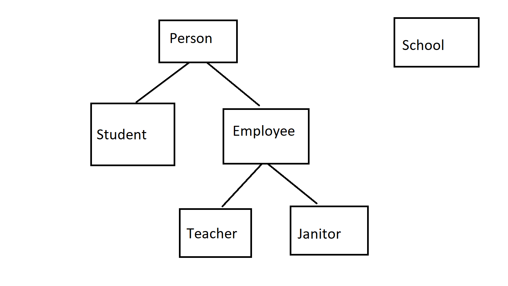

# Homework for Inheritance

Create a Project called FirstName + LastName + Class07

# Part 1: School

Create a package called **school**. Put all classes within this package.

You will be creating a mock school system of the people. You're going to have a school, students, teachers, and janitors. It's going to be a bit annoying, but should be straightforward. 

## Step 1

Create a class called **School.java**

Have it include these instance variables: 

- `String name`: School Name
- `String address`: School Address
- `int numStaff`: number of staff
- `int numStudents`: number of students

Add **one of your choosing**

### Constructors

Create a constructor that takes in all instance variables as parameters.

Create a default constructor

### Create Getters and Setters: 

- Shortcut: Right Click >> Source >> Generate Getters and Setters >>  Click on all variables >> generate
- you're welcome

### Create the following methods:

`public String toString()`: Returns the school name

`public int totalPeople()`: Returns total number of people in the school (staff + students)

## Step 2

Create a class called **Person.java**. 

Have it include these instance variables:

- `String name`: Person's name
- `School school`: A School Object
- `String gender`: The gender
- `int age`: Person's age

### Constructor

Create a constructor that takes in all instance variables as parameters.

Create a default Person

### Generate Getters and Setters

Same thing as above

### Create the following methods:

`public String toString()`: Returns the person's name and their school

Example: John Wick of Cabin John

**One method of your choice**

## Step 3

Make a class called **Employee.java** that **extends Person.java** 

Have it include the following instance variables:

- `double salary`: the salary (per year)

- one attribute of your choosing

### Constructor

#### Normal Constructor

Create a constructor that takes in all attributes from **Person** and itself.

It should look like this:

```java
public Employee(String name, School school, String gender, int age, double salary, Object yourChoice) {
    super(name, school, gender, age);
    // implementation
}
```

#### Default Constructor

Make a default constructor for Employee. 

**Hint:** Call the default constructor of the super!

### Create Getters and Setters

Only for the instance variables inside this class.

### Create the following methods:

`public double getMonthlySalary`: Return the salary made per month

## Step 4

Create the following classes: **Janitor.java** and **Teacher.java**. Both should **extend Employee.java**

For both Janitor and Teacher:

- create **2 instance variables** of your choosing
  - make sure that these instance variables do not overlap with one another or the instance variables from before
  - e.g. make them unique to Teachers and Janitors, respectively
- create a **constructor** that takes in all attributes so far (which is a lot, I know)
  - use copy paste
- Make a default constructor for each. 
  - **Hint:** Call the default constructor of the super!

### Create getters and setters 

Auto-generate

### Methods

**Override the method toString** for both classes. toString should be all the way back at Person in the hierarchy!

It should print instead:

```
John Wick, a teacher at Cabin John

or 

Harry Potter, a janitor at Hogwarts
```

**Hint: ** You can still access attributes even if they aren't explicitly listed since you are a **subclass**.

**One method of your choosing**

## Step 5

Create a class called **Student.java** that is a subclass (extends) **Person.java**.

Create 2 instance variables **unique to a student** of your choosing. 

### Constructor

#### Normal Constructor:

Create a **constructor** that takes in all attributes so far (which is a lot, I know). Call the super.

#### Default:

Create a default constructor. Call the super default to make things easier!

### Getters and Setters

Create them

### Methods

Override `toString` method. 

It should return:

```
Donald Trump, a student at Harvard
```

Override the **method of your choosing you created in Person.java**. Make it make sense. 

### Export the Project and Turn it In

This is what the structure looks like overall:

